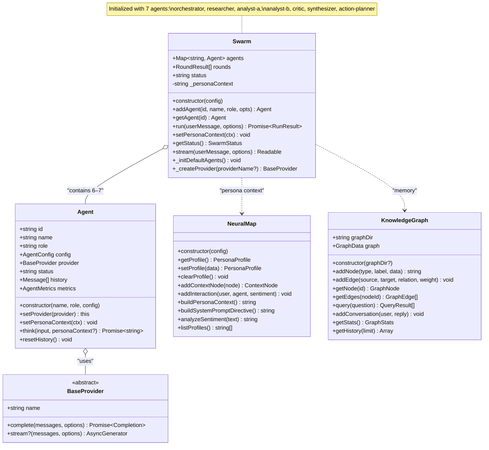
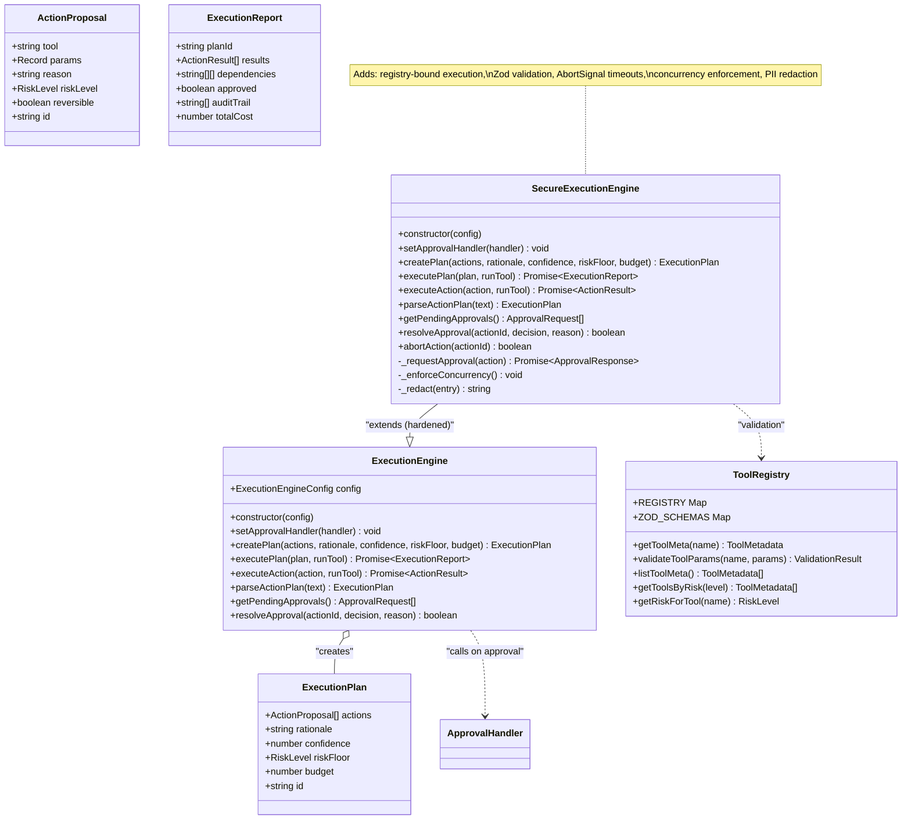
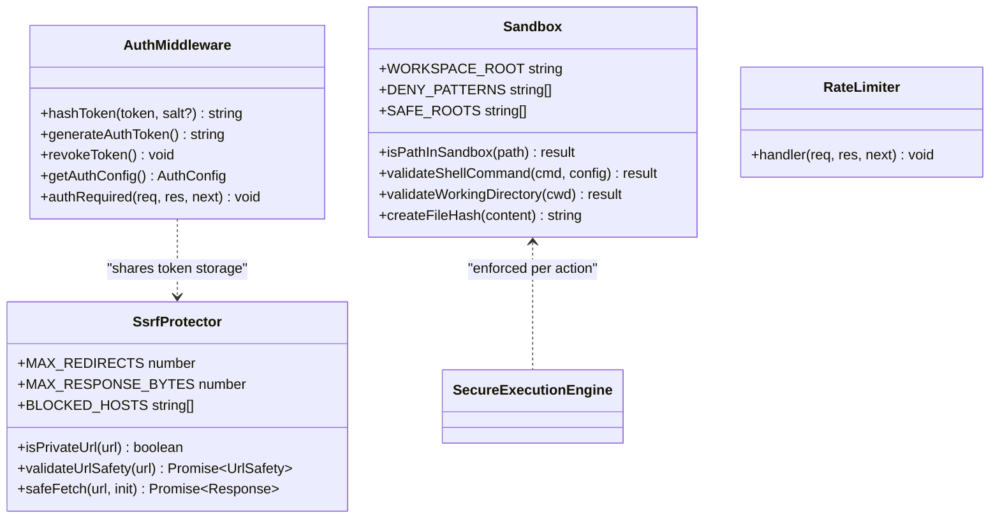
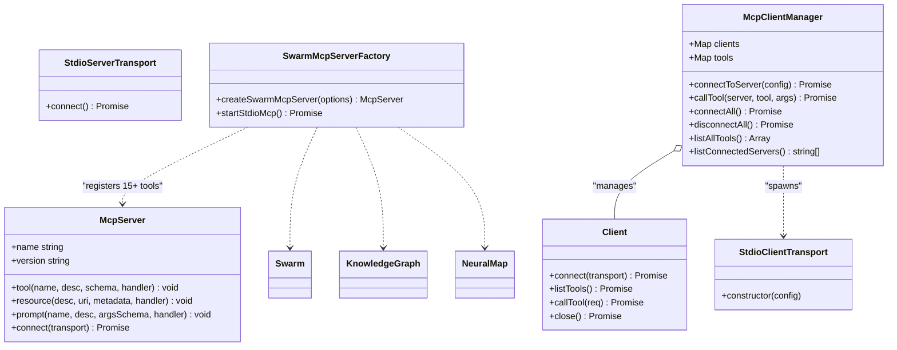

# S-AI — UML Class Diagrams

This document provides Mermaid UML class diagrams for the core architecture of the S-AI Artificial Mind / OpenWorker system. All diagrams are written in [Mermaid](https://mermaid.js.org/) and render natively on GitHub.

## 1. Core Engine Classes

The engine (`@saikarun/s-ai`) is composed of the swarm, agents, neural map, knowledge graph, and execution layer.

## 2. Execution Layer (Synthetic Executive)

The execution layer produces risk-rated action plans, routes them through approval gates, and executes them with full auditability.

## 3. Security Layer

## 4. MCP Integration Classes

---
*Generated from source code. See [sequence-diagrams.md](sequence-diagrams.md) for interaction flows.*
