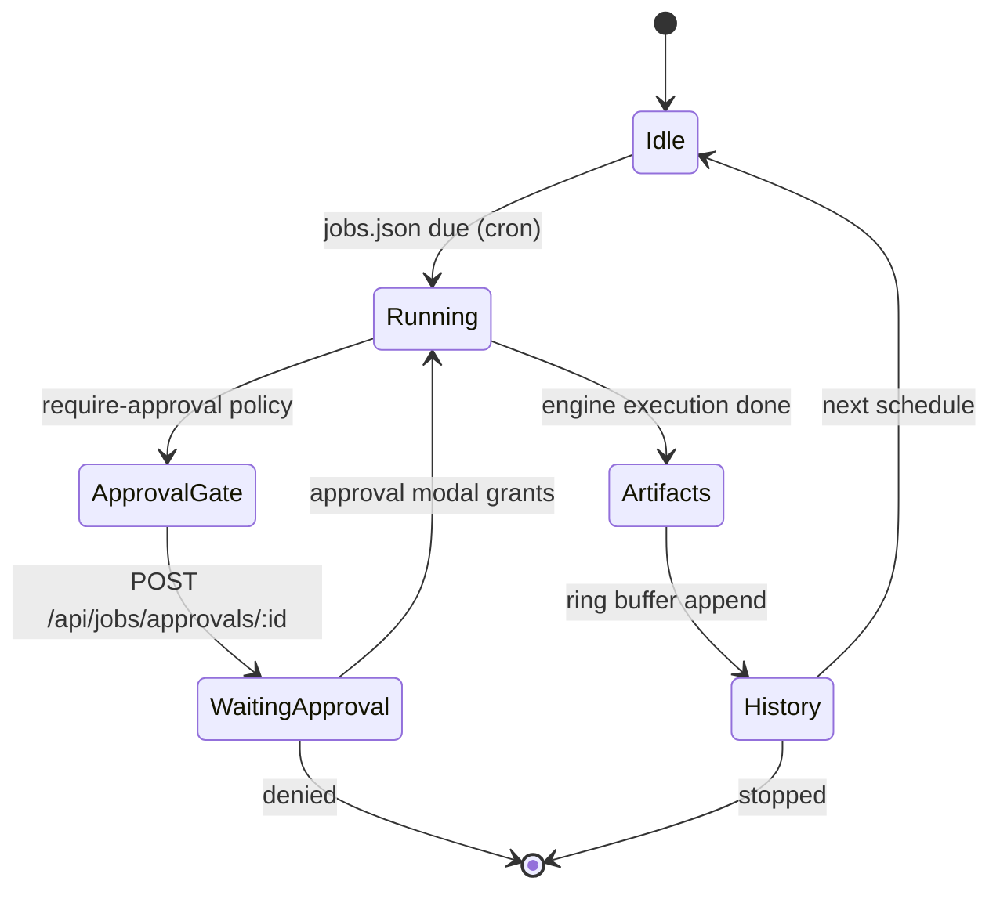
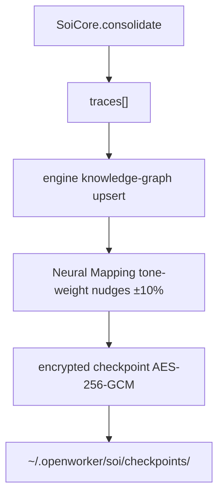

# S-AI — UML Component & Flow Diagrams

High-level composition and state-flow diagrams written in Mermaid. Render natively on GitHub.

## 1. System Component Diagram

```mermaid
flowchart TB
    subgraph Shells["Shells (Distribution)"]
        WIN[Windows setup.exe]
        MAC[macOS .app / DMG]
        LNX[Linux install.sh]
        AND[Android Termux + PWA]
    end

    subgraph Harness["OpenWorker Harness"]
        CLI[openworker CLI shim]
        JOB[job scheduler]
        POL[policy engine]
        VAULT[vault (OS keychain / OKF)]
        UPD[update feed + signature verify]
    end

    subgraph Engine["@saikarun/s-ai Engine"]
        SW[6-Agent Swarm]
        NM[Neural Mapping Persona]
        KG[Knowledge Graph]
        SB[Study Buddy]
        RM[Research Mapper]
        BH[Bhashini]
        MCP[MCP Client / Server]
        CR[Crawl]
        OKF[OKF Crypto]
        SK["Skills (ai-engine, ai-studio, research-mapper, study-buddy, mcp-builder, skill-creator, base)"]
    end

    subgraph Security["Security Layer"]
        AUTH[Auth Middleware]
        SSRF[SSRF Protector]
        SBX[File Sandbox]
        SEX[SecureExecutionEngine]
        TR[Tool Registry + Zod]
    end

    subgraph Adapters["Adapters"]
        PROV[Providers 20+ , provider:model routing]
        JIN[Jina]
        YT[yt-dlp]
        GH[GitHub]
        RSS[RSS]
        ARX[arXiv]
        MULTI[Collabuild MAS]
    end

    Shells --> Harness
    Harness --> Engine
    Engine --> Security
    Harness --> Security
    Security --> Adapters
    Engine --> Adapters

    MCP <--> SW
    MCP <--> KG
    MCP <--> NM
    SEX <--> SW
    SEX <--> TR
    SBX <--> SEX
```

## 2. OpenWorker Job Scheduling Flow



## 3. Provider / Reach Failover

```mermaid
flowchart LR
    T[Task / URL] --> REG[Registry.canHandle]
    REG --> B0[backend[0]]
    B0 -->|failure| MARK[mark unhealthy TTL]
    MARK --> B1[backend[1]]
    B1 -->|failure| MARK2[mark unhealthy TTL]
    MARK2 --> Bn[backend[n]]
    Bn -->|all down| PRESC[error + prescription]
    B0 -->|success| OUT[result]
    B1 -->|success| OUT
    Bn -->|success| OUT
    REG --> DOC[doctor: probe all channels]
    DOC --> M[active matrix]
```

## 4. Consolidation ("Sleep") Flow



---
*See [class-diagrams.md](class-diagrams.md) and [sequence-diagrams.md](sequence-diagrams.md).*
