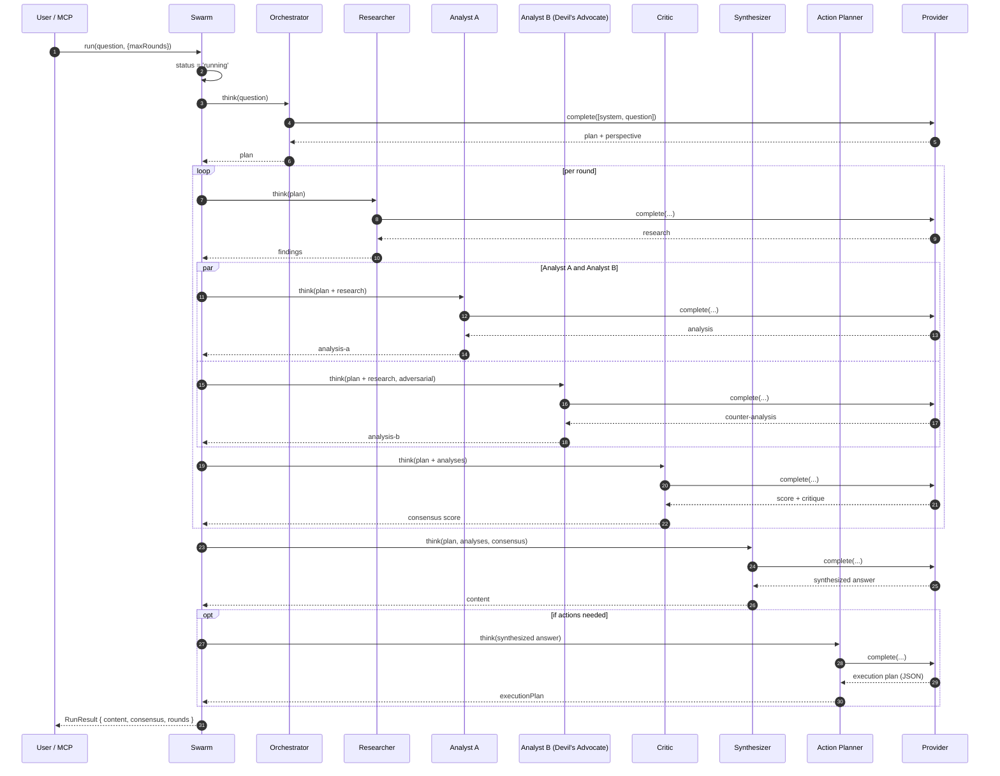
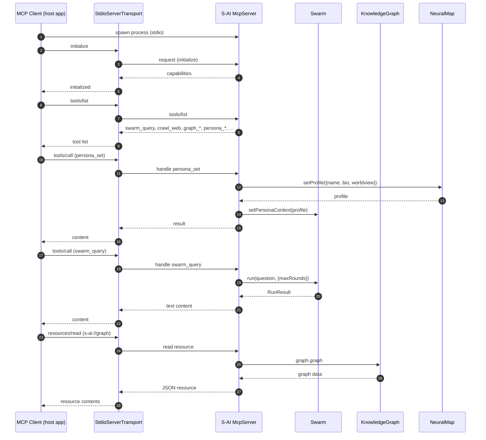
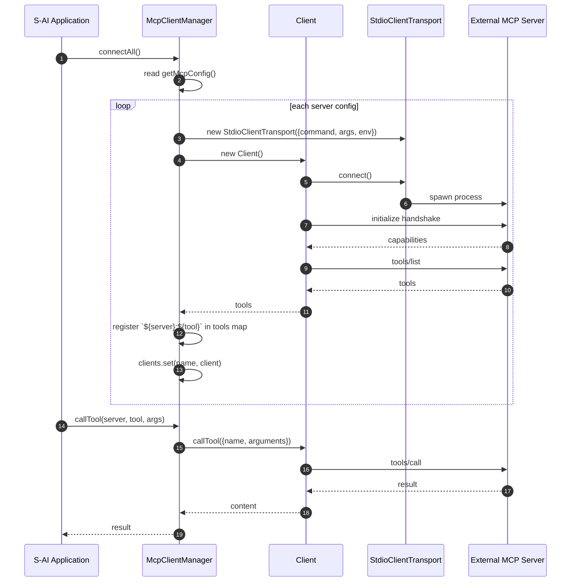
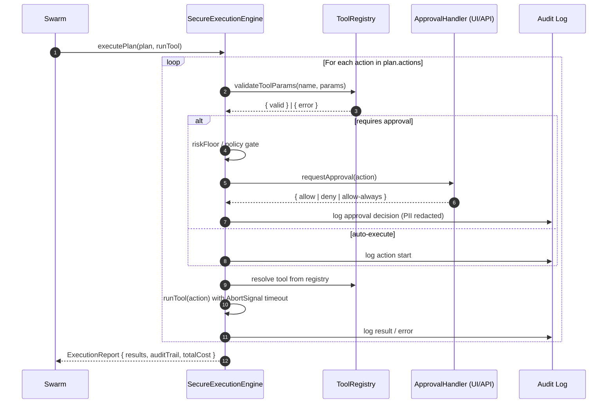
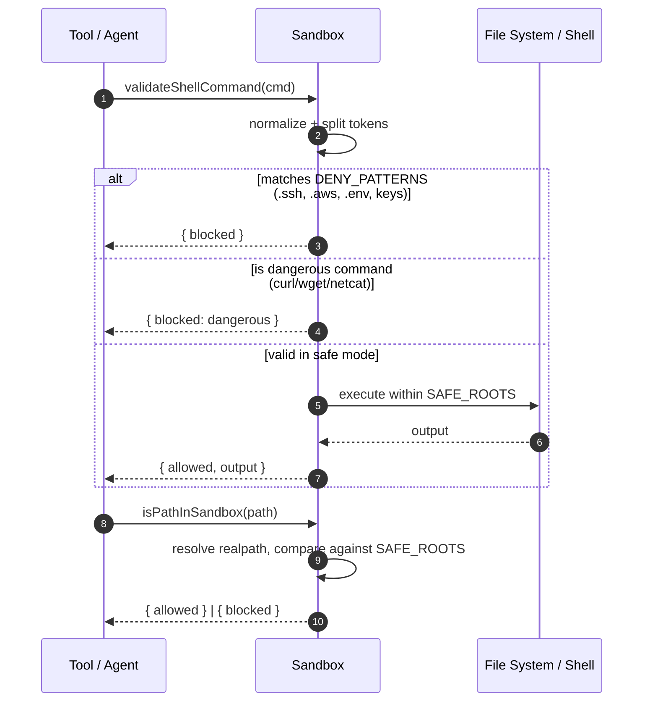

# S-AI — UML Sequence Diagrams

This document provides Mermaid sequence diagrams for the key interaction flows of the S-AI Artificial Mind / OpenWorker system. Diagrams render natively on GitHub.

## 1. Multi-Agent Swarm Query

The core swarm pipeline: Orchestrator → Researchers → Analyst A/B → Critic → Synthesizer, with optional Action Planner producing an execution plan.

## 2. MCP STDIO Server (Exposing S-AI to AI Clients)

Shows how S-AI registers tools/resources/prompts and serves them over stdio for any MCP-compatible client (Claude, Cursor, terminal AIs, etc.).

## 3. MCP Client Manager (Consuming External MCP Servers)

Shows how S-AI connects to external MCP servers (filesystem, github, browser, etc.) and aggregates their tools.

## 4. Synthetic Executive — Tool Execution with Approval

Shows how the execution engine routes an action through the approval gate, then executes it via the tool registry with full audit logging.

## 5. Structured File Sandbox

Shows file-system and shell command validation for untrusted tool operations.

---
*See [class-diagrams.md](class-diagrams.md) for structure and [component-diagrams.md](component-diagrams.md) for high-level composition.*
